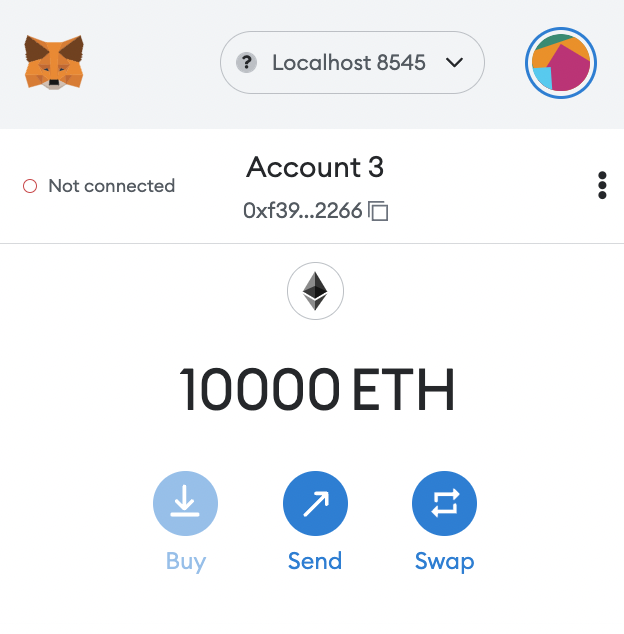
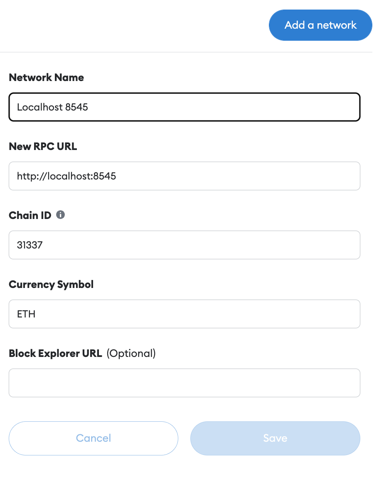
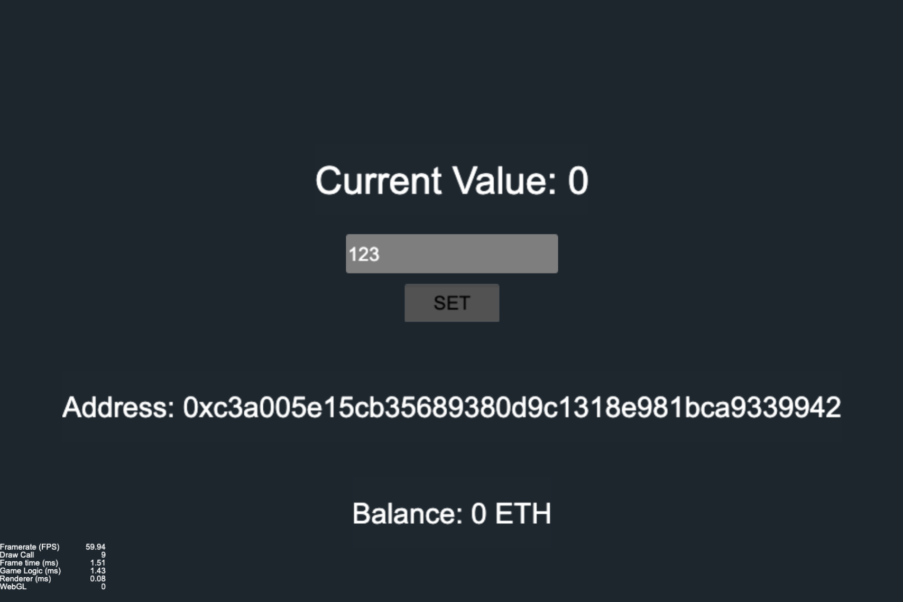
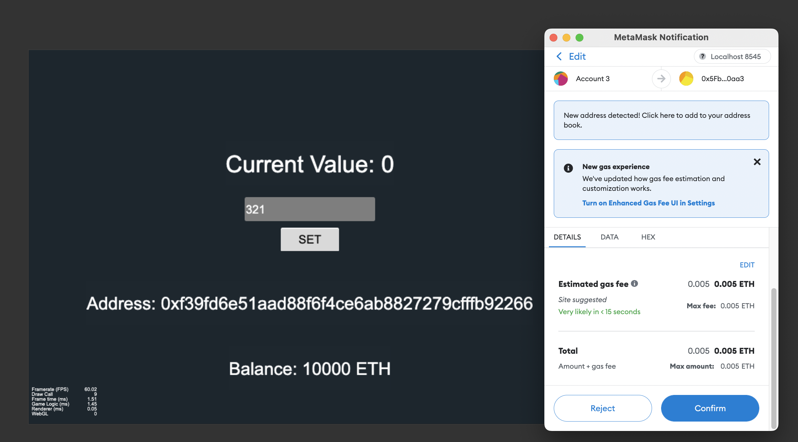
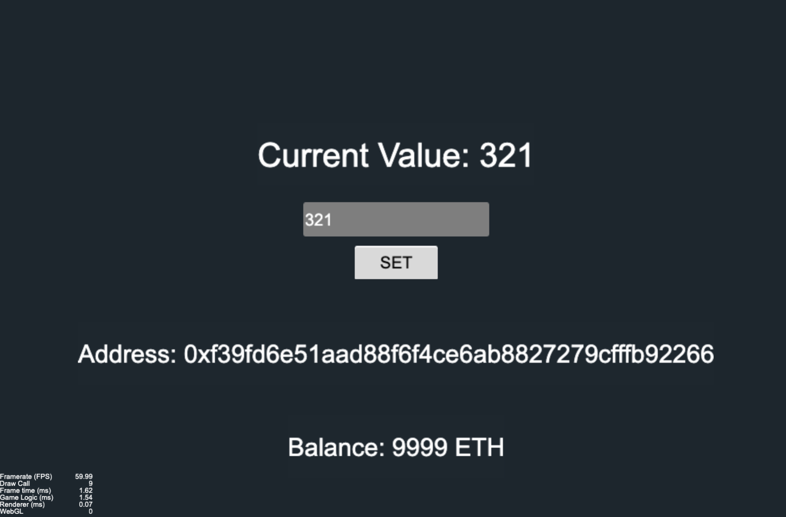

# Welcome to eth-cocos-code-base 👋


[](#)

> code base for Cocos Creator with Ethereum smart contract connection

## Author

👤 **KienDT**

- Website: [https://kiendt.me](https://kiendt.me)
- Github: [@dotrungkien](https://github.com/dotrungkien)

## Prerequisite

- [Cocos Creator (ver 2.4.10)](https://www.cocos.com/en/creator/download)
- [Hardhat](https://hardhat.org/tutorial/creating-a-new-hardhat-project)

## Instructions

### Contract deployment

- Compile SimpleStore smart contract

```bash
cd contract/
yarn
npx hardhat compile
```

- run a local blockchain node, then copy a private key and import it to Metamask, make sure you choose `Localhost 8545` as network on Metamask and see 10000 ETH in account balance.

```bash
npx hardhat node
```



- change the network id on Metamask to 31337 (if needed)



- deploy Simple Storage to local blockchain node.

```bash
npx hardhat run scripts/deploy.js --network localhost
```

- then save deployed address, for example: `0xCf7Ed3AccA5a467e9e704C703E8D87F634fB0Fc9`

### Cocos intergration

- Copy abi file from `contract/artifacts/SimpleStore.sol/SimpleStore.json` to `game/assets/contracts`

- change `contractAddress` in `game/assets/Script/HelloWorld.js` by the address of Simple Store you deployed above

- run scene



- change value and confirm transaction



- finally, transaction completed



## Show your support

Give a ⭐️ if this project helped you!

---

_This README was generated with ❤️ by [readme-md-generator](https://github.com/kefranabg/readme-md-generator)_
